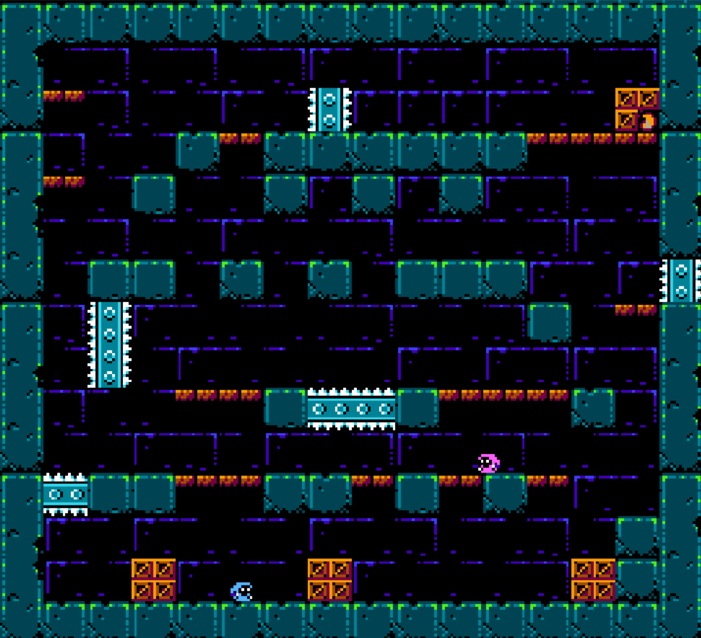

# 40KB_NES

## 🎮 프로젝트 소개
**40KB_NES**는 닌텐도 엔터테인먼트 시스템(NES/패미컴) 하드웨어 환경에서 구동되도록 제작된 게임
제한적인 8-bit 하드웨어 자원 안에서 효율을 추구하며, 게임 로직 구현하는데 중점을 둠

---
## 🛠 Tech Stack

| Category | Technology | Description |
| :--- | :--- | :--- |
| **Language** | **C (cc65), 6502 Assembly** | 로직 구현 및 하드웨어 직접 제어 (Hybrid Programming) |
| **Hardware** | **NES** | Nintendo Entertainment System (Famicom) Architecture |
| **Compiler** | **cc65** | 6502 Cross-Compiler for NES development |
| **Graphics** | **YY-CHR, Tiled** | Binary Tile Data Conversion & Map Editing |

---

## 🛠 기술 구현 상세 (Technical Implementation)

### 1. 8-bit 환경에 최적화된 물리 엔진 및 로직 구현 (Core Logic & Physics)
* **고정 소수점 연산 (Fixed-Point Arithmetic):**
    * 부동소수점(Float) 연산이 불가능한 NES 하드웨어(6502 CPU)에서 부드러운 가속도와 관성을 구현하기 위해 16-bit 고정 소수점 로직을 사용함

### 2. 그래픽 파이프라인 및 메모리 최적화 (Graphics & Optimization)
* **바이너리 타일 데이터 및 VRAM 관리:**
    * 그래픽 에셋을 엔진 자동화 없이 NES PPU가 인식 가능한 바이너리 타일 데이터로 직접 변환하여 CHR ROM에 배치하고 관리함.
* **미러링, 팔레트스왑 (Mirroring & Palette Swapping):**
    * 하드웨어 스프라이트 개수 제한과 용량 한계를 극복하기 위해 미러링(Mirroring)기법으로 동일 스프라이트를 반전시켜 재사용하고, 팔레트 스왑(Palette Swapping)을 통해 색상 정보만 교체하여 텍스처 메모리를 절약함

### 3. 충돌 처리 및 입력 시스템 (Collision & Input System)
* **효율적인 타일 기반 충돌 처리 (AABB & Ejection):**
    * 연산 부하를 줄이기 위해 캐릭터 코너의 타일 속성을 검사하는 AABB 방식을 적용
    * 충돌 시 비트 연산을 통해 즉시 유효 좌표로 보정하는 Ejection 알고리즘을 이용하여 끼임 현상을 방지함
* **Context-Sensitive Action (입력 한계 극복):**
    * A, B 두 개의 버튼만 존재하는 하드웨어적 제약을 극복하기 위해, 플레이어의 상태(지상, 공중, 벽 근처 등)에 따라 액션이 분기되는 시스템을 설계하여 조작의 깊이와 편의성을 동시에 확보함
---

## 💡 프로젝트 회고 및 배운 점 (Retrospective)

    * 부동소수점 연산이 불가능한 8-bit CPU 환경에서 고정 소수점(Fixed-point) 연산을 적용하고, 비트 연산(`>>`, `&`)을 활용한 충돌 처리*를 구현함
    * 현대의 풍족한 하드웨어 환경에서는 간과하기 쉬운 메모리의 중요성을 몸소 체감하며 최적화의 중요성을 인지함
    * 상용 엔진(Unity/Unreal)이 자동으로 처리하던 드로우 콜(Draw Call)과 렌더링 과정을 PPU 레지스터($2000 ~ $2007) 조작을 통해 구현되는 모습을 경험함
    * 데이터가 CPU에서 VRAM으로 이동하고, OAM을 거쳐 화면에 주사(Scanline)되기까지의 하드웨어적 렌더링 파이프라인을 경험하고 이해하게 됨
    * 하드웨어의 물리적 한계(스프라이트 개수 제한, 버튼 부족 등)를 미러링, 팔레트 스와핑, 다기능 입력 시스템 등 소프트웨어적으로 극복해내며 문재 해결 능력을 기름

---
## 👥 팀 구성 (Credits)

| 이름 | 포지션 | 담당 업무 |
|:---:|:---:|:---|
| **박민성** | **Lead Developer** | **개발 총괄 (Pixel Art 제외 전 분야)**
| **배도영** | |

---

## ⚠️ 라이선스 및 저작권 (License & Copyright)
* **Project Status:** 본 프로젝트는 기술 연구 및 개인 포트폴리오 제작을 목적으로 한 **비상업적(Non-commercial)** 프로젝트임.
* **Asset Disclaimer:**
    * 본 게임의 그래픽 리소스는 **Morphcat Games**의 **'Micro Mages'** 에셋을 활용하였음.
    * 해당 에셋의 저작권은 원작자에게 있으며, 본 프로젝트는 훌륭한 8-bit 게임인 원작의 그래픽 스타일과 최적화 방식을 학습하고 존경을 표하는 오마주(Homage)의 성격을 띠고 있음.
    * 상업적 목적으로 배포하거나 판매하지 않음.
