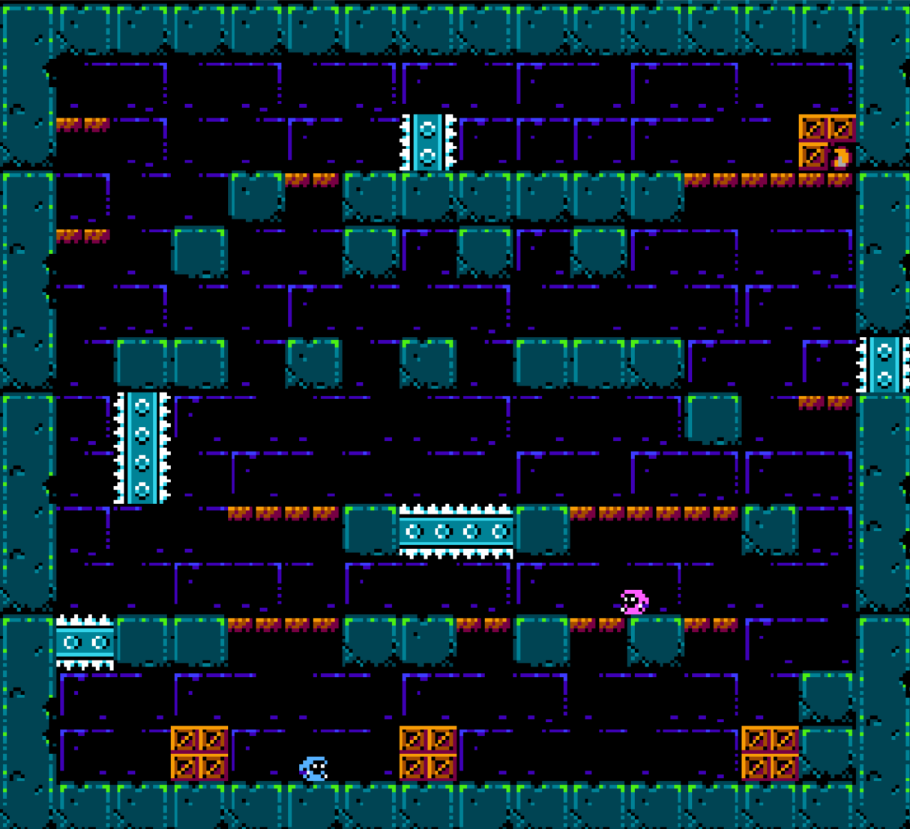
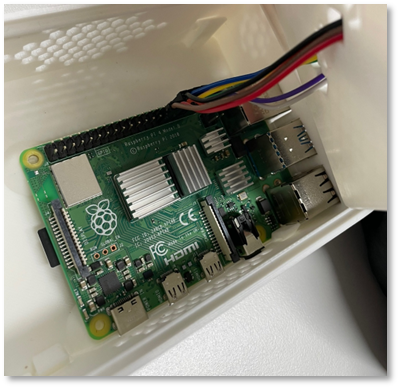
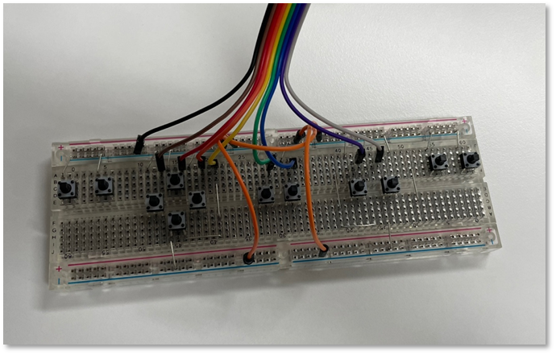

# 40KB_NES

> 40KB ROM 제약 안에서 동작하는 NES 2인 대전 플랫포머



| 항목 | 내용 |
| :--- | :--- |
| 플랫폼 | NES / Famicom (NROM-256 매퍼) |
| 언어 | C (cc65), 6502 Assembly |
| 최종 ROM | **40,976 bytes** = iNES 헤더 16B + PRG 32KB + CHR 8KB |
| 개발 기간 | 2024.11 ~ 2025.01 (10주) |
| 팀 규모 | 2인 |

<br>

## 🎮 프로젝트 소개

두 명의 플레이어가 하나의 화면에서 동시에 경쟁하는 8-bit 플랫포머입니다.

NES는 1.79MHz의 6502 CPU와 2KB RAM만을 제공합니다. 부동소수점 연산 유닛이 없고, 액션 버튼은 A와 B 두 개뿐입니다. 이 제약을 우회하지 않고 조건으로 받아들여, **제한된 자원 안에서 게임 로직을 어떻게 설계할 수 있는지** 를 다룬 프로젝트입니다.

### 플레이 방법

1. [`BUILD/last.nes`](BUILD/last.nes) 를 다운로드합니다.
2. NES 에뮬레이터(Mesen, FCEUX, Nestopia 등)로 실행합니다.
3. 컨트롤러 2개를 연결해 1P / 2P 동시 플레이가 가능합니다.

<br>

## 📌 이 저장소의 출발점과 작업 범위

이 프로젝트는 **공개된 예제 코드를 분석해 확장한 결과물** 입니다. 기반이 된 코드는 Doug Fraker(nesdoug)의 cc65용 메타타일 예제이며, 원저작자 표기는 [`metatiles.c`](metatiles.c) 최상단에 그대로 유지하고 있습니다.

```c
/*  example code for cc65, for NES
 *  draw a BG with metatile system
 *  , also sprite collisions with BG
 *  using neslib
 *  Doug Fraker 2018
 */
```

원본은 1인용 이동·충돌 데모였고, 게임으로서의 규칙과 승패 판정, 2인 대전 구조는 없었습니다. 작업의 절반 이상은 남이 쓴 코드를 읽고 어디를 건드려야 하는지 판단하는 일이었습니다.

### 원본에서 확장한 부분

| 구분 | 내용 |
| :--- | :--- |
| 2인 대전 구조 | 컨트롤러 2개 입력을 각각 처리하고, 플레이어별 물리·충돌 루프와 상태 변수를 분리 |
| 게임 규칙 | 타일 속성으로 함정·목표를 판정해 사망 리스폰과 승패 결정 로직 구현 |
| 액션 시스템 | 상태에 따라 같은 버튼의 의미가 바뀌는 공중 대시 추가 |
| 애니메이션 | 방향·정지·모션 3축 상태 분기와 프레임 카운터 기반 스프라이트 순환 |
| 버그 수정 | 고정소수점 좌표의 부호 없는 정수 오버플로로 발생한 화면 순간이동 문제 해결 |
| 빌드 자동화 | Tiled 맵의 CSV 익스포트를 C 배열 소스로 변환하는 Python 스크립트 작성 |
| 실행 환경 | Raspberry Pi 4 + RetroPie 구성, 케이스 3D 프린팅, GPIO 물리 컨트롤러 제작 |

<br>

## 🛠 Tech Stack

| Category | Technology | Description |
| :--- | :--- | :--- |
| Language | C (cc65), 6502 Assembly | 게임 로직은 C, 하드웨어 근접 부분은 어셈블리 |
| Toolchain | cc65 / ca65 / ld65 | 6502 크로스 컴파일러 · 어셈블러 · 링커 |
| Library | neslib (Shiru), nesdoug | NES 하드웨어 추상화 라이브러리 |
| Mapper | NROM-256 | PRG 32KB + CHR 8KB 고정 구성, 뱅크 스위칭 없음 |
| Graphics | YY-CHR | CHR ROM 타일 데이터 편집 |
| Level Design | Tiled + 자체 Python 스크립트 | 맵 편집 후 C 배열로 자동 변환 |
| Runtime | Raspberry Pi 4 + RetroPie | 전용 실행 환경 및 GPIO 컨트롤러 |

<br>

## ⚙️ 기술 구현 상세

### 1. 8.8 고정소수점 좌표계

6502에는 부동소수점 연산 유닛이 없습니다. 그런데도 가속과 관성이 있는 이동감을 만들기 위해, 16비트를 상위 8비트(정수부)와 하위 8비트(소수부)로 나눠 쓰는 **8.8 고정소수점** 을 좌표계로 사용했습니다.

```c
#define SPEED 0x180          // 1.5 px/frame  (0x180 >> 8 = 1, 나머지 0x80 = 0.5)

signed int hero_velocity_x;  // signed, low byte is sub-pixel
signed int hero_velocity_y;
```

- 상위 바이트만 읽으면 그대로 픽셀 좌표가 되므로, 렌더링 시 변환 비용이 없습니다.
- 가감속과 중력, 낙하 속도 상한을 소수부 누산으로 구현했습니다.

### 2. 제로페이지 세그먼트 활용

6502는 상위 주소가 `$00`인 **제로페이지** 접근이 일반 주소보다 명령 1바이트, 사이클 1회 저렴합니다. 매 프레임 갱신되는 입력·충돌·좌표 변수를 제로페이지 세그먼트에 배치하고, 2P용으로 추가한 입력·상태 변수도 같은 구간에 넣었습니다.

```c
#pragma bss-name(push, "ZEROPAGE")

unsigned char pad1, pad1_new;
unsigned char pad2, pad2_new;               // 2P 입력
unsigned char direction2, direction_idle2;  // 2P 애니메이션 상태
signed int    hero_velocity_x, hero_velocity_y;
unsigned int  old_x, old_y;
```

### 3. 타일 속성을 게임 규칙으로 사용

함정과 목표 지점을 별도 오브젝트 시스템으로 관리하면 관리 구조와 판정 코드가 함께 늘어납니다. 메모리를 늘리는 대신 **이미 있는 데이터에 의미를 더 얹는 방향** 을 선택했습니다.

메타타일 맵 하나에 지형·함정·목표를 함께 인코딩하고, 충돌 검사 과정에서 이미 읽고 있는 타일 속성값으로 사망 리스폰과 승패를 판정합니다. 새 자료구조 없이 게임 규칙이 성립합니다.

### 4. 타일 기반 AABB 충돌과 Ejection 보정

캐릭터의 코너 좌표에 해당하는 타일 속성만 검사하는 AABB 방식으로 충돌 판정 연산량을 억제했습니다.

충돌이 감지되면 **비트 연산으로 유효 좌표를 즉시 계산해 밀어내는 Ejection 처리** 로 지형에 끼이는 현상을 방지합니다. 타일 크기가 2의 거듭제곱이라 나눗셈 없이 마스킹으로 처리됩니다.

```c
eject_L = temp_x | 0xf0;         // 좌측 충돌 시 타일 경계로 스냅
eject_R = (temp_x + 1) & 0x0f;   // 우측 충돌 시 잔여 오프셋만 추출

high_byte(BoxGuy1.x) = high_byte(BoxGuy1.x) - eject_L;
```

### 5. 버튼 2개 제약을 상태 기반 분기로 해결

NES 컨트롤러의 액션 버튼은 A와 B 두 개뿐입니다. 버튼을 늘릴 수 없으니 **상태를 늘려 조작의 폭을 확보** 했습니다.

접지 상태에서는 점프가, 공중에서는 착지 전 단 한 번만 대시가 발동하도록 플래그로 게이팅했습니다. 같은 버튼이 플레이어의 상태에 따라 다른 의미를 갖습니다.

### 6. 레벨 데이터 파이프라인 자동화

맵을 수정할 때마다 타일 인덱스를 손으로 옮기는 작업이 반복됐습니다. [`BG/CSV2C.py`](BG/CSV2C.py) 를 작성해 **Tiled의 CSV 익스포트를 C 배열 소스로 자동 변환** 하도록 만들어, 맵 편집과 빌드 사이의 수작업을 제거했습니다.

<br>

## 🐛 트러블슈팅 — 화면 끝에서 캐릭터가 순간이동하는 버그

**증상**

화면 좌측 끝으로 계속 이동하면 캐릭터가 우측 끝에 나타났습니다.

**오진**

화면 경계에서만 발생했기 때문에 처음에는 경계 처리 로직을 의심했지만, 해당 코드에는 문제가 없었습니다.

**원인**

좌표계 자체였습니다. 8.8 고정소수점 좌표가 **부호 없는 정수** 였기 때문에, 값이 0보다 작아지는 순간 최대치로 되돌아가며 캐릭터가 화면을 한 바퀴 돌았습니다. 속도 변수는 `signed`였지만 좌표는 그렇지 않았습니다.

**해결**

캐릭터가 경계에 닿지 않게 막는 방식은 증상만 가리는 처리였습니다. 직전 프레임 좌표(`old_x`, `old_y`)를 기준으로 캐릭터가 화면 어느 쪽에 있었는지 판별해, **해당 방향의 경계값으로 클램프** 하도록 수정했습니다. 오버플로가 발생해도 이동 방향을 알고 있으면 어느 끝으로 보내야 하는지 결정할 수 있습니다.

**배운 것**

자료형과 수 표현의 선택이 곧 버그의 형태를 결정합니다.

<br>

## 🔧 빌드

cc65 툴체인(`cc65` / `ca65` / `ld65`)이 설치되어 있어야 합니다.

```bash
make
# 또는 Windows
compile.bat

# 산출물: BUILD/last.nes  (40,976 bytes)
```

레벨 데이터를 수정하는 경우:

```bash
# 1. Tiled에서 BG/untitled.tmx 편집 후 CSV로 익스포트
# 2. C 배열 소스로 변환
cd BG && python CSV2C.py
# 3. 다시 빌드
make
```

<br>

## 🎛 실행 환경

에뮬레이터 외에 전용 실행 환경을 직접 구성했습니다.

| 구성 | 내용 |
| :--- | :--- |
| 본체 | Raspberry Pi 4 + RetroPie |
| 케이스 | 직접 3D 모델링해 프린팅한 전용 케이스 |
| 입력 | 브레드보드에 택트 스위치를 배선한 2인용 컨트롤러 |
| 연결 | GPIO 핀 입력을 게임 컨트롤러 입력으로 매핑 |

<p align="center">
  
  
</p>

> **실기기 검증 범위**
> 실제 NES 하드웨어에서의 동작 검증은 진행하지 않았습니다. ROM이 NROM-256 규격을 따르므로 실기기 호환이 예상되지만, 개발과 테스트는 에뮬레이터와 위 RetroPie 환경에서 수행했습니다. 실기기용 카트리지 제작은 향후 과제입니다.

<br>

## 📁 저장소 구조

```text
.
├── metatiles.c              # 게임 로직 (원본 예제 기반 확장)
├── metatiles.h              # 전역 변수 · 제로페이지 세그먼트 정의
├── Sprites.h                # 메타스프라이트 정의
├── metatiles.chr            # CHR ROM 타일 데이터 (8KB)
├── crt0.s                   # 스타트업 코드
├── nrom_32k_vert.cfg        # 링커 설정 (PRG 32KB + CHR 8KB)
├── makefile / compile.bat
├── BG/
│   ├── untitled.tmx         # Tiled 맵 원본
│   ├── CSV2C.py             # CSV → C 배열 변환 스크립트
│   └── Room1.c              # 변환 결과
├── NES_ST/
│   ├── meta.py              # 메타타일 데이터 처리 스크립트
│   └── metatiles.bmp/.nam/.txt
├── LIB/
│   ├── neslib.h/.s          # NES 하드웨어 추상화 (Shiru)
│   └── nesdoug.h/.s         # 보조 라이브러리 (Doug Fraker)
└── BUILD/
    ├── last.nes             # 최종 ROM (40,976 bytes)
    ├── metatiles.s          # 컴파일러가 생성한 어셈블리
    └── labels.txt           # 링커 심볼 맵
```

<br>

## 📝 개발 과정

10주 일정을 단계별로 문서화했습니다.

| 회차 | 단계 | 내용 |
| :---: | :--- | :--- |
| 1 | 회의 | 프로젝트 구체화, 개발 환경 · 언어 · 일정 결정 |
| 2 | 설계 | 게임 구조 설계 |
| 3 | 타일맵 · 스프라이트 | 그래픽 데이터 파이프라인 구축 |
| 4 | 애니메이션 | 스프라이트 애니메이션 구현 |
| 5 | 물리 | 이동 · 중력 · 충돌 구현 |
| 6 | 게임 디자인 | 규칙 및 승패 조건 설계 |
| 7 | 레벨 디자인 | 스테이지 구성 |
| 8 | 완성 보고서 | 결과 정리 및 회고 |

<br>

## 💡 회고

**상용 엔진이 대신 해 주던 일이 실제로는 무슨 일인지 알게 됐습니다.**
Unity에서 `transform.position`에 float를 넣던 작업이, 여기서는 소수부를 직접 관리하고 오버플로를 직접 막는 일이 됐습니다. 좌표계를 스스로 정의해야 하는 환경에서는 자료형 선택이 버그의 형태를 결정한다는 것을 체감했습니다.

**메모리를 늘릴 수 없을 때 설계가 달라집니다.**
함정과 목표를 별도 시스템으로 만드는 대신 타일 속성에 의미를 겹쳐 넣는 선택은, 용량이 넉넉했다면 하지 않았을 것입니다. 제약이 좁을 때 오히려 구조를 더 오래 들여다보게 된다는 것을 배웠습니다.

**남이 쓴 코드를 읽는 일이 절반이었습니다.**
처음부터 짜는 것보다 기존 구조를 파악하고 확장 지점을 판단하는 데 시간이 더 들었습니다. 원본이 1인용 데모라는 전제 아래 쓰인 코드에 2P를 넣으면서, 어떤 변수가 플레이어별로 분리되어야 하고 어떤 것이 공유되어도 되는지를 하나씩 결정해야 했습니다.

**개선할 점**
- 플레이어별로 거의 동일한 충돌 처리 코드가 중복되어 있습니다. 파라미터화해 통합하면 PRG ROM 사용량이 줄어들 여지가 있습니다.
- 2P용 상태 변수 일부(`can_jump2`, `frame_count2`, `die1`, `die2`)가 제로페이지 밖에 남아 있어, 접근 비용이 1P 쪽보다 큽니다.

<br>

## 👥 팀 구성

| 이름 | 포지션 | 담당 업무 |
| :---: | :--- | :--- |
| **박민성** | 프로젝트 리드 | 게임 로직, 물리 · 충돌, 애니메이션, 빌드 자동화, 실행 환경 구성 |
| **배도영** | 프로그래머 / 그래픽 | 그래픽 데이터 작업, 개발 보조 |

<br>

## ⚠️ 라이선스 및 저작권

기술 학습 및 포트폴리오 목적의 **비상업적(Non-commercial)** 프로젝트입니다. 배포하거나 판매하지 않습니다.

**본인 저작 범위**

저장소의 [`LICENSE`](LICENSE)(MIT)는 이 프로젝트에서 직접 작성한 코드에만 적용됩니다. 아래 제3자 코드와 에셋에는 적용되지 않으며, 각 원저작자의 권리가 유지됩니다.

**기반 코드**

| 대상 | 원저작자 |
| :--- | :--- |
| 메타타일 예제 코드 (`metatiles.c` 기반) | Doug Fraker (nesdoug) |
| `LIB/neslib.h`, `LIB/neslib.s` | Shiru |
| `LIB/nesdoug.h`, `LIB/nesdoug.s` | Doug Fraker |

**그래픽 에셋**

그래픽 리소스는 Morphcat Games의 **Micro Mages** 에셋을 활용했습니다. 해당 에셋의 저작권은 원작자에게 있으며, 재배포나 상업적 이용을 허락하지 않습니다. 본 프로젝트는 뛰어난 8-bit 게임인 원작의 그래픽 스타일과 최적화 방식을 학습하고 존경을 표하는 **오마주(Homage)** 성격을 가집니다.
